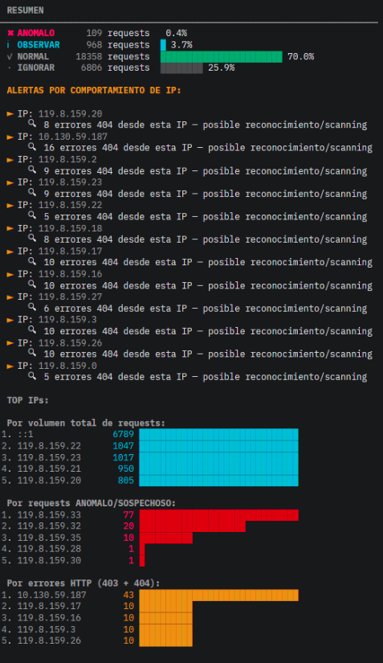
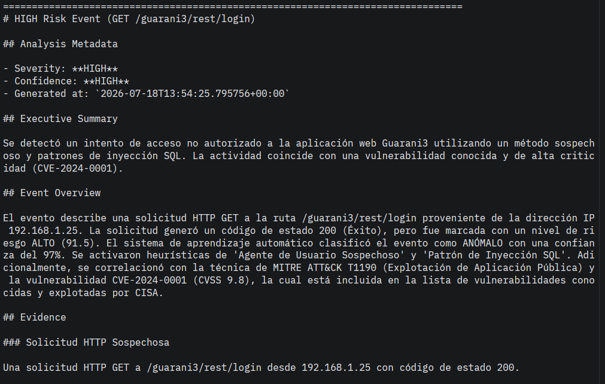

<div align="center">
  <a href="https://snsanchez.github.io/logguard-guarani/" target="_blank">
    
  </a>

  <h1>LogGuard Guaraní</h1>

  <p>
    <strong>Plataforma defensiva para el análisis de logs Apache</strong><br>
    Heurísticas • Machine Learning • Threat Intelligence • Agente SOC • TUI
  </p>

  <p>
    
    
    
    
    
  </p>

  <p>
    📖 <a href="https://snsanchez.github.io/logguard-guarani/"><strong>Documentación</strong></a>
    &nbsp;·&nbsp;
    📄 <a href="https://github.com/snsanchez/logguard-guarani/blob/main/docs/paper/LogGuard%20Guarani%20-%20Short%20Paper.pdf">Short paper</a>
    &nbsp;·&nbsp;
    🐛 <a href="https://github.com/snsanchez/logguard-guarani/issues">Reportar un problema</a>
  </p>
</div>

---

LogGuard Guaraní es una plataforma offline-first para el análisis defensivo de logs Apache.

Combina detección heurística, clasificación mediante Machine Learning, enriquecimiento con inteligencia de amenazas y un **agente SOC** asistido por IA para ayudar al analista a interpretar eventos de alto riesgo.

El proyecto fue desarrollado como prueba de concepto en el LIA (Laboratorio de Informática Aplicada) para el ecosistema **SIU Guaraní** de la Universidad Nacional de Río Negro, aunque su arquitectura resulta aplicable a cualquier servidor Apache.

---

# Características

- Análisis de logs Apache completamente offline
- Motor heurístico explicable
- Clasificación mediante Machine Learning (SVM)
- Enriquecimiento con MITRE ATT&CK, NVD y CISA KEV
- Generación automática de reportes SOC
- Base de conocimiento local actualizable
- Interfaz TUI interactiva
- Interfaz CLI para automatización
- Arquitectura modular y extensible

---

# Interfaz TUI

LogGuard v4 incorpora una **Text User Interface (TUI)** desarrollada con Textual que facilita su uso desde una interfaz moderna e interactiva.

Permite:

- seleccionar archivos de log visualmente
- configurar la carpeta de trabajo
- actualizar la base de conocimiento
- visualizar reportes SOC renderizados
- ejecutar análisis en tiempo real
- mantener configuración persistente

Toda la lógica continúa ejecutándose mediante la CLI oficial de LogGuard, por lo que ambas interfaces producen exactamente los mismos resultados.

---

## Vista previa

> Próximamente se incorporará un video de demostración.

<!-- VIDEO -->

<p align="center">

<!-- Screenshot TUI -->

</p>

---

# Interfaz CLI

LogGuard CLI resulta ideal para automatización, cron, Docker y servidores sin interfaz interactiva.

Ejemplo básico:

```bash
python3 src/logguard_guarani.py access.log
```

Mostrar únicamente eventos relevantes:

```bash
python3 src/logguard_guarani.py access.log --solo-anomalos
```

Ejecutar clasificación ML + agente SOC:

```bash
python3 src/logguard_guarani.py access.log --razonar
```

Actualizar la base de conocimiento:

```bash
python3 src/logguard_guarani.py \
    --actualizar-conocimiento \
    --online
```

> Referencia completa de flags y ejemplos adicionales: [Referencia CLI](https://snsanchez.github.io/logguard-guarani/#cli).

---

# Demo incluida

El repo incluye un ejemplo completamente funcional para probar LogGuard sin necesidad de disponer de logs propios.

```
examples/
├── apache_demo.log
└── apache_demo_report.md
```

Con este archivo es posible:

- ejecutar un análisis completo
- generar un reporte SOC
- comparar el resultado con un reporte previamente generado

Es el punto de partida recomendado para conocer el funcionamiento de la herramienta.

---

# Instalación

```bash
python3 -m venv .venv

source .venv/bin/activate

pip install -r requirements.txt
```

---


## Características principales

### Pipeline de análisis

LogGuard implementa un pipeline completo:

```
Apache Logs
    |
Parser
    |
Analysis Event
    |
Heuristics + Scoring
    |
Attack Classification
    |
Machine Learning
    |
Risk Mapping
    |
Threat Intelligence Enrichment
    |
SOC Agent
    |
Markdown Report
```

> Para el detalle completo de cada etapa, modelos de datos y la separación entre el pipeline de detección (determinístico) y el de razonamiento (agente SOC), ver la [documentación de arquitectura](https://snsanchez.github.io/logguard-guarani/#architecture-overview).

---

## Vista previa

Resumen de eventos agrupado por IP de origen:

<p align="center">
  
</p>

Fragmento de un reporte generado por el agente SOC:

<p align="center">
  
</p>

---
# Docker

La imagen Docker incluye la aplicación completa:

- CLI
- TUI
- Base de conocimiento
- SOC Agent

Construcción:

```bash
docker build \
    -t san2s/logguard-guarani:4.0.0 .
```

Ejecución mediante CLI:

```bash
docker run --rm \
    -v /ruta/logs:/data \
    san2s/logguard-guarani:4.0.0 \
    /data/access.log
```
---

## Cómo citar

Si utilizás LogGuard Guaraní en un trabajo académico o de investigación, podés citar el short paper asociado al proyecto:

> Sánchez, S. N., García, N., Castro, N. (2026). *LogGuard Guaraní: Plataforma Inteligente para el Análisis Defensivo de Logs Apache mediante un Agente SOC e Inteligencia de Amenazas*. Universidad Nacional de Río Negro — Laboratorio de Informática Aplicada (LIA).

El artículo completo, con metodología, resultados y referencias, está disponible en la [sección Short Paper de la documentación](https://snsanchez.github.io/logguard-guarani/#paper).

---

## Autores

Desarrollado en el **Laboratorio de Informática Aplicada (LIA)**, Universidad Nacional de Río Negro — Sede Atlántica, Viedma.

- Santiago Nicolás Sánchez
- Nicolás García
- Nicolás Castro
---
## Contribuciones

¿Encontraste un bug o tenés una idea para mejorar el proyecto? Los [issues](https://github.com/snsanchez/logguard-guarani/issues) y pull requests son bienvenidos. Si vas a proponer un cambio grande, abrí primero un issue para discutirlo.

---
## Seguridad

Este repositorio no contiene logs reales ni información institucional sensible.

Los datos utilizados durante el desarrollo fueron excluidos del repositorio por motivos de privacidad y seguridad.

---
## Licencia

Distribuido bajo licencia **GPL v3**. Ver [`LICENSE`](LICENSE) para más información.
